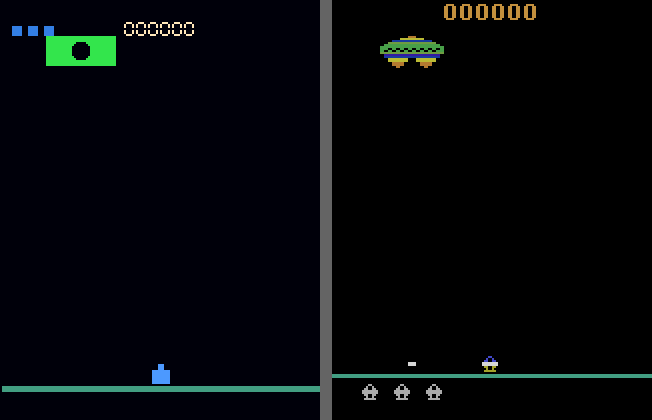

# Assault



*Figure 1.1. Atarax (left) vs. ALE (right)*

> Game ID: `"atari/assault-v0"`

Operate a ground-fixed turret at the bottom of the screen.  A large mothership
crosses at the top and releases attacker craft that float slowly down toward
you.  Fire straight up or diagonally while moving — but watch the heat bar:
rapid firing builds heat and overheating costs a life.

## Spaces

| | Value |
| --- | --- |
| **Observation** | `Box(uint8, shape=(210, 160, 3))` |
| **Actions** | `Discrete(7)` |

### Action table

| Index | Meaning |
| --- | --- |
| `0` | NOOP |
| `1` | FIRE — shoot straight up |
| `2` | UP — redirected to FIRE (barrel raises, shoots up) |
| `3` | RIGHT |
| `4` | LEFT |
| `5` | RIGHTFIRE — move right + fire diagonally right |
| `6` | LEFTFIRE — move left + fire diagonally left |

## Reward

| Event | Points |
| --- | --- |
| Fighter (red square) destroyed | +65 |
| Bomber (orange circle) destroyed | +65 |
| Mothership (green) destroyed | +130 |

The mothership requires **5 hits** to destroy.

## Episode End

The episode ends when all lives are exhausted or the step limit is reached.
A life is lost when:

- an enemy bullet hits the turret, or
- the heat bar reaches maximum (overheat).

## Lives

The player starts with 3 lives.

## Enemy Behaviour

### Mothership

The green mothership crosses horizontally near the top of the screen, bouncing
between the left and right edges.  It must be hit 5 times before it is
destroyed; a smaller hit-box than its visual size means shots must be aimed
carefully.  After destruction it respawns after a short delay.

### Attackers

The mothership releases attackers one at a time (max 3 on screen simultaneously,
10 per wave).  Each attacker is one of two types, chosen at random:

| Type | Shape | Colour |
| --- | --- | --- |
| Fighter | Square | Red `(0.90, 0.25, 0.15)` |
| Bomber | Circle | Orange `(0.90, 0.55, 0.10)` |

Attackers float slowly downward, drift left or right, and randomly reverse
horizontal direction (wiggle).  They bounce off the screen edges and land on
the ground — they never leave the screen.  Attackers fire back at the player
with slow downward bullets.

A wave completes when all 10 attackers have been released and all are
destroyed; the mothership then respawns and a new wave begins.

## Heat Bar

The green bar at the bottom-left shows the current heat level (0–100).

- Each shot fired adds **+15 heat**.
- Heat passively decreases by **1 per emulated frame** (~4 per agent step).
- Reaching max heat (100) kills the player and resets heat to 0.
- Firing is blocked while the bar is full (overheat prevents shooting).

## Screen Geometry

| Element | Position / size |
| --- | --- |
| Turret | y = 188 (fixed), x ∈ [10, 150] |
| Mothership | y = 25, starts at x ≈ 40, hw = 18, hh = 8 |
| Ground line | y = 194, full width, cyan |
| Heat bar | y = 200, bottom-left, max width 40 px |

## Interactive Play

```python
from atarax.utils.render import play

play("atari/assault-v0")
play("atari/assault-v0", scale=2, fps=30)
```

### Keyboard controls

| Key | Action |
| --- | --- |
| `Space` | Fire (straight up) |
| `→` / `D` | Move right |
| `←` / `A` | Move left |
| `→` + `Space` | Move right + fire diagonally right |
| `←` + `Space` | Move left + fire diagonally left |
| `Esc` / close window | Quit |
