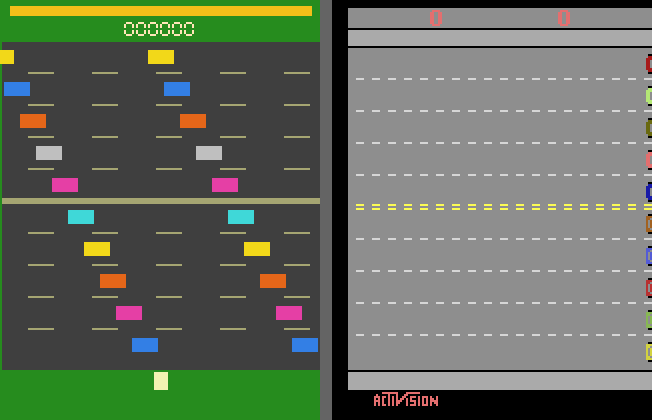

# Freeway



*Figure 1.1. Atarax (left) vs. ALE (right)*

> Game ID: `"atari/freeway-v0"`

Guide a chicken across 10 lanes of traffic from the bottom of the screen to
the top. Each successful crossing earns +1. Cars push the chicken back on
contact rather than costing a life. The episode ends after a fixed time limit.

## Spaces

| | Value |
| --- | --- |
| **Observation** | `Box(uint8, shape=(210, 160, 3))` |
| **Actions** | `Discrete(3)` |

### Action table

| Index | Meaning |
| --- | --- |
| `0` | NOOP |
| `1` | UP — move toward goal |
| `2` | DOWN — move back toward start |

## Reward

| Event | Points |
| --- | --- |
| Cross all 10 lanes (reach top) | +1 |
| Hit by a car | 0 (pushback, no penalty) |

## Episode End

The episode ends when the time limit of **7200 emulated frames** (1800 agent
steps at 4× frame skip) is exhausted. There is no lives-based termination.

## Lives

No lives system. `lives` is always `0`.

## Traffic Layout

The road is divided into two halves separated by a solid centre divider:

| Half | Lanes | Direction | Speed range |
| --- | --- | --- | --- |
| Top half | 0–4 (low y) | ← Left | 0.5–1.8 px/frame |
| Bottom half | 5–9 (high y) | → Right | 0.5–1.6 px/frame |

Each lane contains **2 cars**. Speed varies significantly between lanes —
some lanes carry slow trucks, others fast cars — producing uneven gaps that
the player must time carefully.

### Lane colour table

| Lane | Direction | Colour |
| --- | --- | --- |
| 0 (topmost) | ← Left | Yellow `(0.95, 0.85, 0.10)` |
| 1 | ← Left | Blue `(0.20, 0.50, 0.90)` |
| 2 | ← Left | Orange `(0.90, 0.40, 0.10)` |
| 3 | ← Left | Silver `(0.75, 0.75, 0.75)` |
| 4 | ← Left | Pink `(0.90, 0.25, 0.65)` |
| 5 | → Right | Cyan `(0.25, 0.85, 0.85)` |
| 6 | → Right | Yellow `(0.95, 0.85, 0.10)` |
| 7 | → Right | Orange `(0.90, 0.40, 0.10)` |
| 8 | → Right | Pink `(0.90, 0.25, 0.65)` |
| 9 (bottommost) | → Right | Blue `(0.20, 0.50, 0.90)` |

## Collision

When the chicken's AABB overlaps a car:

- A **downward pushback impulse** of +8.0 is applied to `pushback_vy`.
- Each subsequent frame the pushback decays by ×0.8 until it reaches 0.
- No life is lost; the chicken can be pushed all the way back to the start.

## Screen Geometry

| Element | Position / size |
| --- | --- |
| Road | y ∈ [20, 185] |
| Lane height | 16 px |
| Centre divider | y = 100 (solid stripe) |
| Chicken x | x = 80 (fixed) |
| Chicken start | y = 190 |
| Goal threshold | y − hh ≤ 10 |
| Timer bar | top strip, y = 5, fills from left |

## Interactive Play

```python
from atarax.utils.render import play

play("atari/freeway-v0")
play("atari/freeway-v0", scale=2, fps=30)
```

### Keyboard controls

| Key | Action |
| --- | --- |
| `↑` / `W` | UP (move toward goal) |
| `↓` / `S` | DOWN (move back) |
| `Esc` / close window | Quit |
